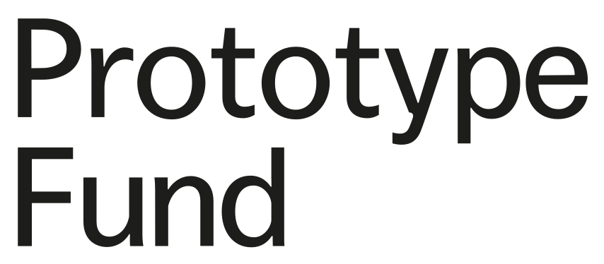

[](https://github.com/open-public-transport/open-public-transport-results/issues)

<br />
<p align="center">
  <a href="https://github.com/open-public-transport/open-public-transport-results">
    
  </a>

  <h1 align="center">Open Public Transport (Results)</h1>

  <p align="center">
    Results storage of <a href="https://github.com/open-public-transport/open-public-transport-results" target="_blank">Open
     Public Transport results</a> 
  </p>
</p>

## About The Project

tbd

### Built With

* tbd

## Installation

Initialize the submodules of this repository by running the following commands.

```shell script
git submodule init
git submodule update
```

## Usage

tbd

## Roadmap

See the [open issues](https://github.com/open-public-transport/open-public-transport-results/issues) for a list of proposed features (and
 known issues).

## Contributing

tbd

## Funding

Between September 2021 through February 2022 this project is founded by [German Federal Ministry of Education and Research](https://www.bmbf.de/bmbf/en/home/home_node.html) and supported by [Prototype Fund](https://prototypefund.de/).

<p align="center">
  <a href="https://www.bmbf.de/bmbf/en/home/home_node.html">
    
  </a>
  <a href="https://prototypefund.de/">
    
  </a>
</p>

## License

Distributed under the GPLv3 License. See [LICENSE.md](./LICENSE.md) for more information.

## Contact

kontakt@openpublictransport.de
